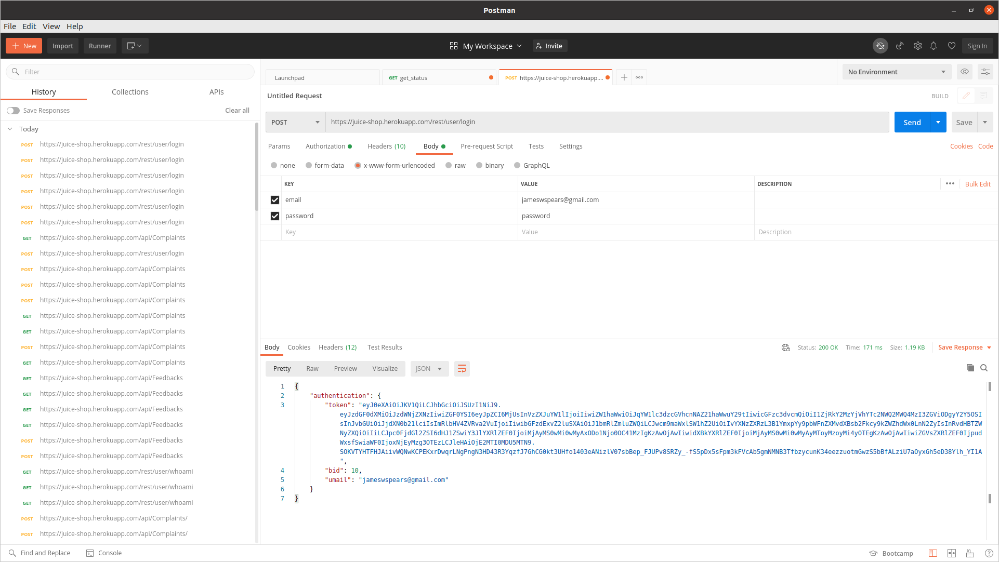
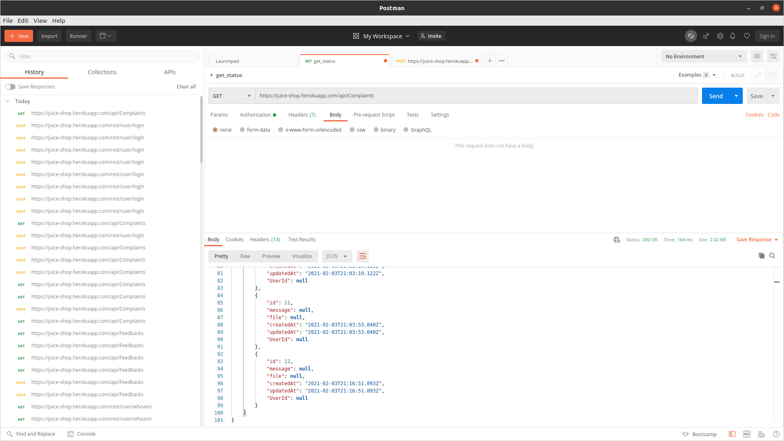
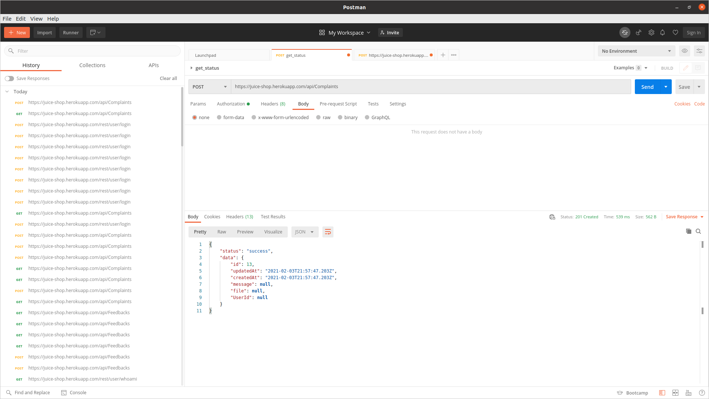
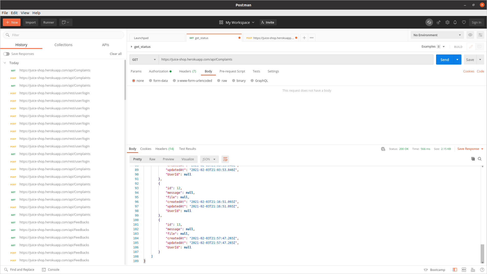

# Broken Anti Automation - Example

To reproduce, follow the steps below. *Note: this example requires Postman.*

0. Sign up for an account. 
   
   * This can be most easily done on the site using the UI.
      It should be noted there is an obvious issue with the email validation as a non-valid email such
      as ``not@nemail`` will suffice. This is itself a security risk that a bot could easily exploit
      by creating hundreds or thousands of user accounts. Our credentials are:
   
      * user: ``not@nemail``
      * password: ``password``


1. Retrieve an API token.

   

   * The login endpoint is https://juice-shop.herokuapp.com/rest/user/login. Make sure you have set
      the ``Content-Type: application/x-www-form-urlencoded`` if you are following along with Postman.
     
      * Your token should look something like this: 
           ```txt
           eyJ0eXAiOiJKV1QiLCJhbGciOiJSUzI1NiJ9.eyJzdGF0dXMiOiJzdWNjZXNzIiwiZGF0YSI6eyJpZCI6MjUsInVzZXJuYW1lIjoiIiwiZW1haWwiOiJqYW1lc3dzcGVhcnNAZ21haWwuY29tIiwicGFzc3dvcmQiOiI1ZjRkY2MzYjVhYTc2NWQ2MWQ4MzI3ZGViODgyY2Y5OSIsInJvbGUiOiJjdXN0b21lciIsImRlbHV4ZVRva2VuIjoiIiwibGFzdExvZ2luSXAiOiJ1bmRlZmluZWQiLCJwcm9maWxlSW1hZ2UiOiIvYXNzZXRzL3B1YmxpYy9pbWFnZXMvdXBsb2Fkcy9kZWZhdWx0LnN2ZyIsInRvdHBTZWNyZXQiOiIiLCJpc0FjdGl2ZSI6dHJ1ZSwiY3JlYXRlZEF0IjoiMjAyMS0wMi0wMyAxODo1Njo0OC41MzIgKzAwOjAwIiwidXBkYXRlZEF0IjoiMjAyMS0wMi0wMyAyMToyMzoyMi4yOTEgKzAwOjAwIiwiZGVsZXRlZEF0IjpudWxsfSwiaWF0IjoxNjEyMzg4OTk5LCJleHAiOjE2MTI0MDY5OTl9.LfDzgLYqwJVUh65FHp__AtFNm_rHWwaeyD05xuCJDuxTmzq_xfFu74MvfLnZLKGV-iWZwkcV9YOSOgtJYNoxe8KMeAgDfdkjg2QSuLIzcDHUlVF8vN6q6un1KLx64_omzDhYYT0JLBHSrek2jQZs38yR37hoFjFppLITdaio7-g
           ```

2. Visit the complaints section.

   

   * At the time of writing there are 12 complaints.
   
3. Lodge an erroneous complaint.
   
   

   * Notice you do not need to embed any data into the body of the request in order to receive a
     status code 201 created. This should certainly be a status 400 malformed request. There is no
     need to be creating records for no message, no file, no user. This type of design flaw is what
     someone who is orchestrating a DoS or DDoS attack would use.
     
4. Verify the complaint was created.

   
   
   * Notice there is not even a user recorded, even though we are logged in.