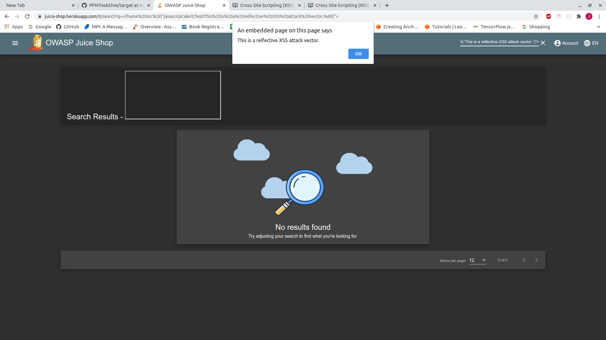

# Reflected XSS - Example

1. Navigate to the main landing page.

    
   
2. Click the search icon located in the toolbar.

    

3. Search for: `<iframe src="javascript:alert(`This is a relfective XSS attack vector.`)">`

    
   
    * One can imagine embedding a link to malicious site into the `iframe` and luring users away
      from a legitimate site. This may confuse users as they may unintentionally trust the link,
      thinking it originated from the site.